

  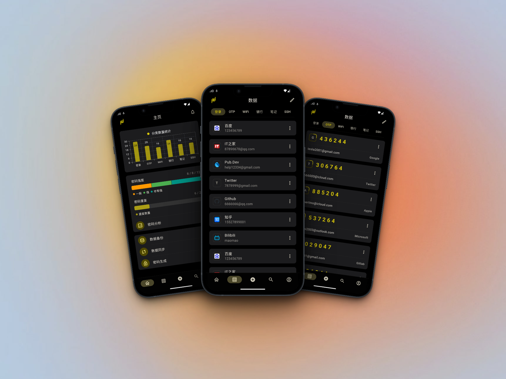

  
 passad - 隐私数据管理器 

---

# 📚 介绍

`passad` 是一款基于 [Flutter](https://flutter.dev/)的隐私数据管理器, 理论上支持Flutter支持的所有平台，目前主要支持 `Android` 和 `iOS` 平台。采用质感设计，并支持多种主题色。

下面是已实现的主要功能:

### 1、支持多种类型的数据
- 登录账号
- 银行卡信息
- WiFi信息
- SSH连接信息
- TOTP
- 隐私笔记

### 2、支持本地密码强度分析和重复密码分析

### 3、支持`Android`和`iOS`平台的自动填充

### 4、支持深色模式，多种主题色选择

### 5、支持TOTP（谷歌两部验证）

### 6、支持数据备份（本地备份和WebDAV）

### 7、支持数据同步

### 8、支持密码生成器

## 
# 📸 Screenshots

## 🌕️ Dark Mode

  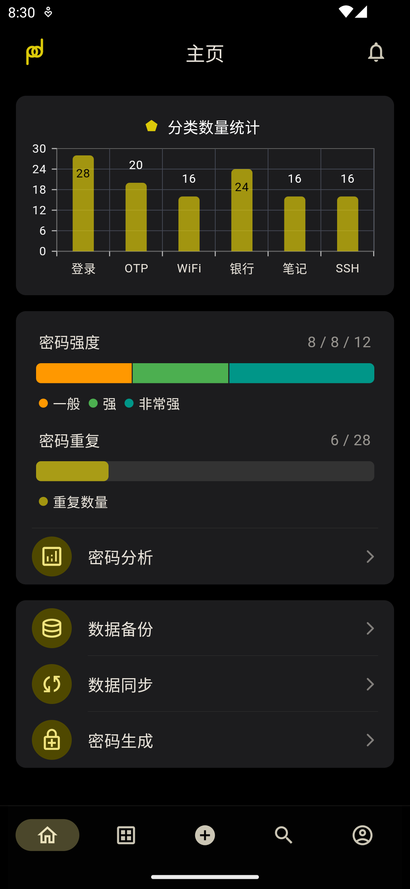

  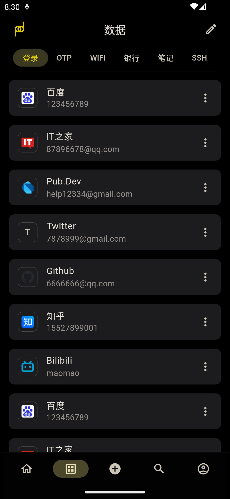

  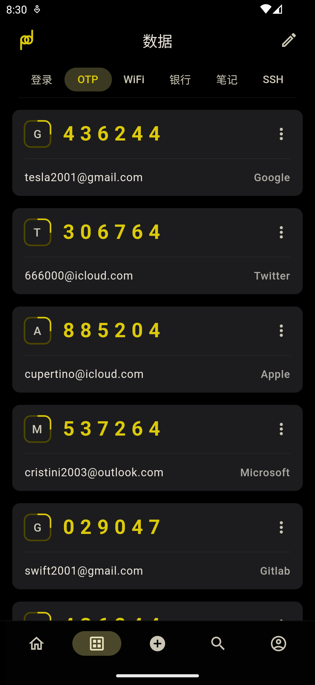

  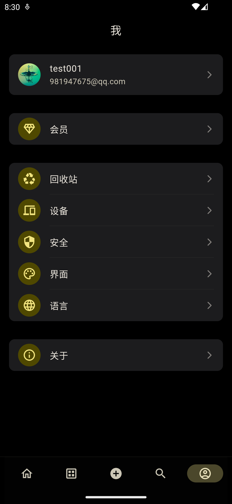

  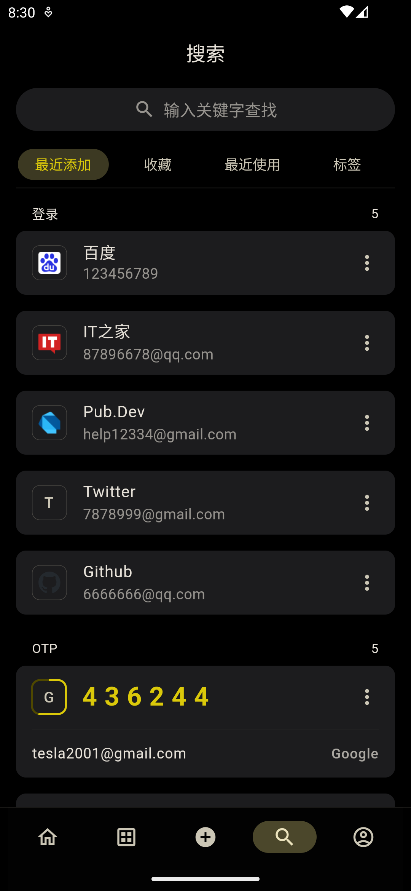

  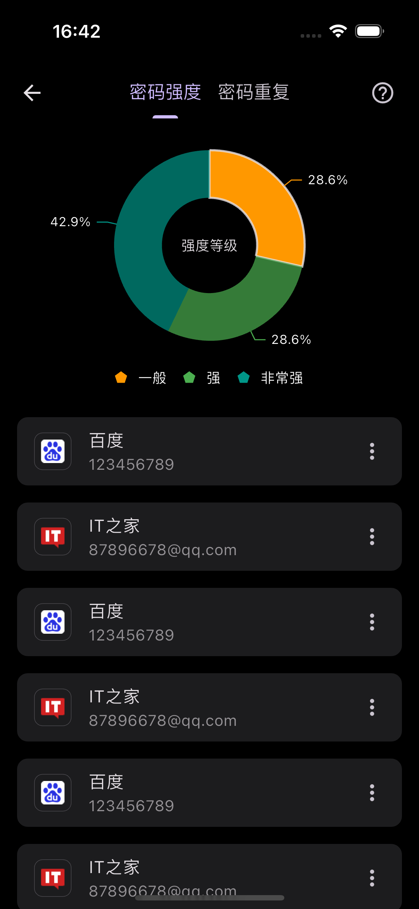

## 🌞️ Bright Mode

  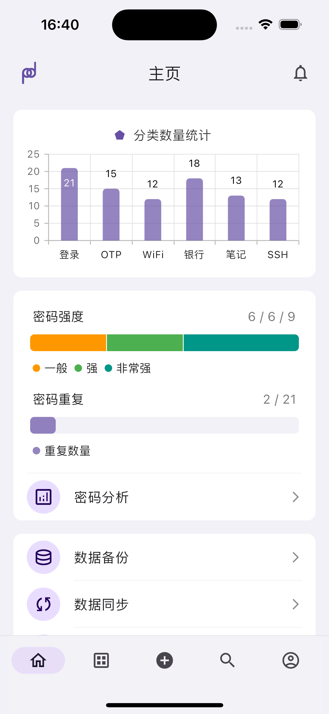

  

  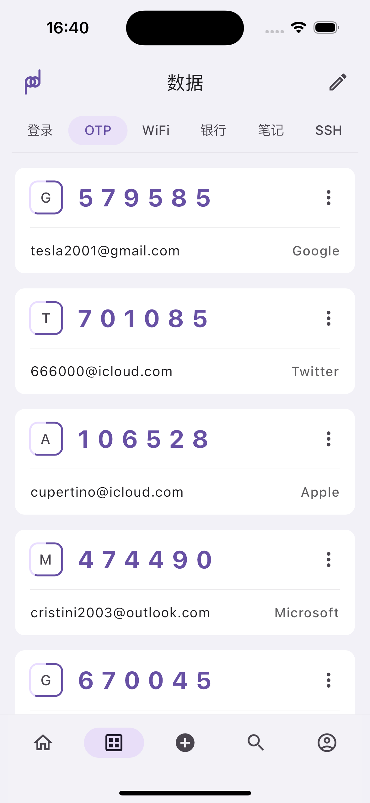

  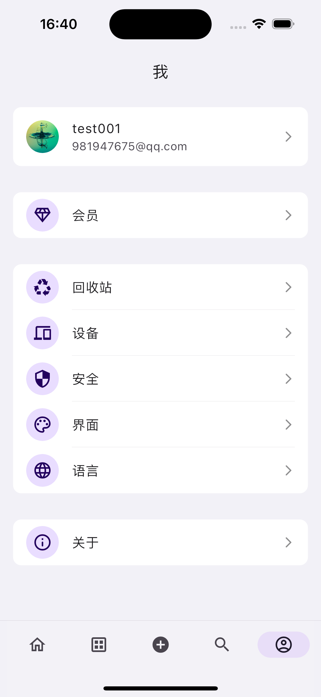

  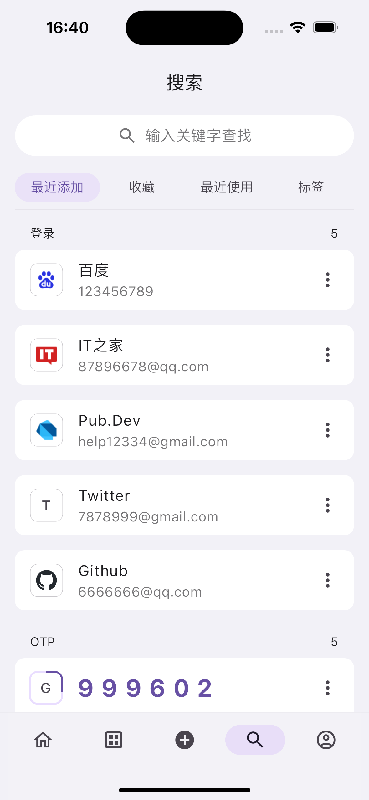

  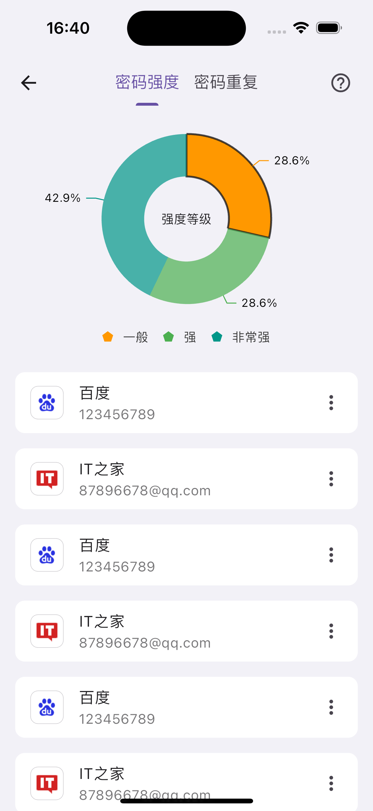

<!-- # 📦 How to use

- For `Android`

  Go [Releases Page](https://github.com/BrightVan/mercurius/releases) and select the latest version of `app-arm64-v8a-release.apk` to download and install it

- For `Windows`

  Go [Releases Page](https://github.com/BrightVan/mercurius/releases) and select the latest version of `Mercurius.for.Windows.zip` to download and unzip it, the double click `Mercurius.exe` -->

# ⏳ 进度

即将发布正式版。

# 🧑‍💻 贡献者

# 🔦 Declaration

This project is licensed under the terms of the `GPL-3.0` license. See [LICENSE](https://github.com/BrightVan/mercurius/blob/master/LICENSE) for more details