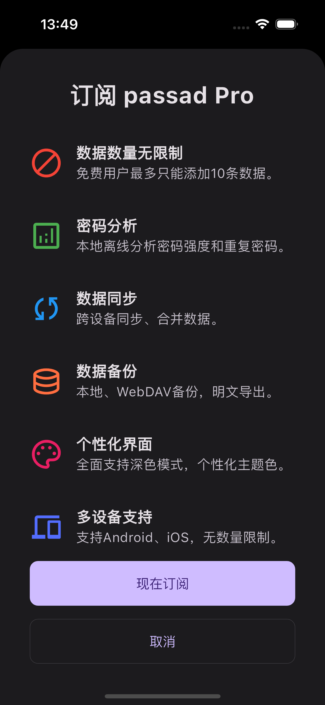

# 会员权益
> 开发和维护一个产品需要很多成本，`passad`并非完全免费，下面是付费用户所能享受的权益：

- 数据数量无限制，免费用户最多添加10条数据
- 可以使用密码分析功能，查看密码强度和重复密码
- 跨设备数据同步
- 数据备份导出，WebDAV备份
- 个性化界面，支持深色模式，主题色等自定义选项
- 多设备登录使用，不限制数量

  

# 版本买断
> `passad`使用x.y.z三位版本号，y代表小功能更新，z代表错误修复，x代表大版本更新，您可以买断一个大版本生命周期的，只需支付一次，就可以永久使用该大版本，并免费获得该大版本的所以小功能更新和问题修复，每个大版本独立，你可以自由选择是否再次付费升级到下一个大版本。